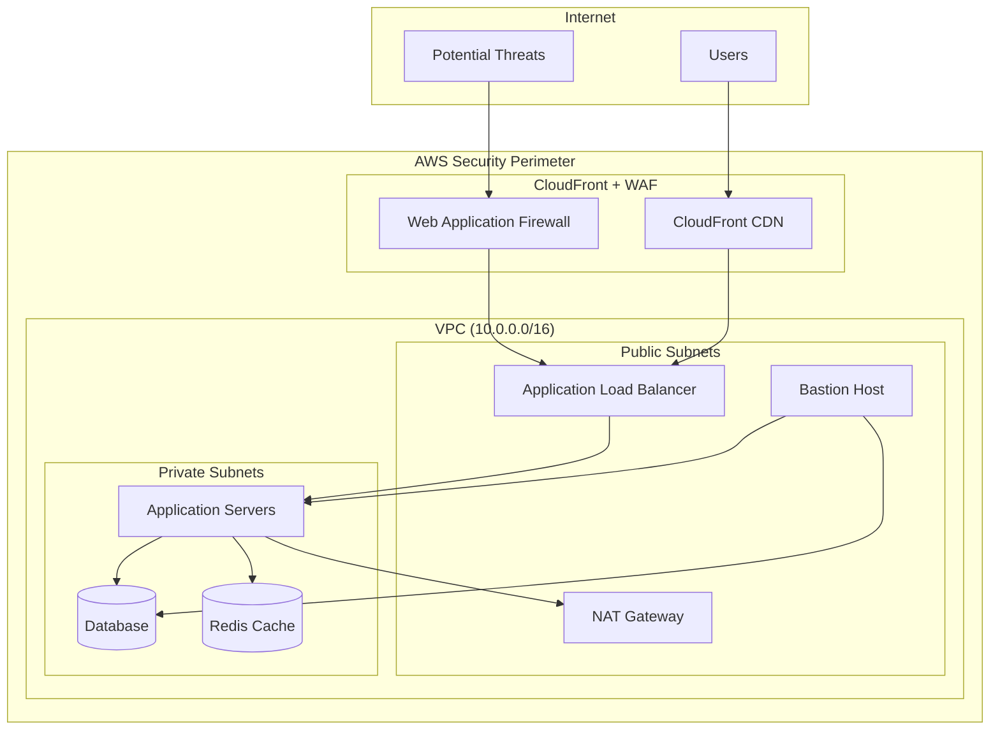

# 🔐 Security Implementation Guide

## 🎯 **Security Overview**

This document outlines the comprehensive security strategy implemented in the Smart Contract Rewriter Platform, demonstrating enterprise-grade security practices and compliance frameworks.

---

## 🛡️ **Security Principles**

### **🔧 Zero Trust Architecture**
- **Never Trust, Always Verify**: Every request authenticated and authorized
- **Principle of Least Privilege**: Minimal access rights for all components
- **Defense in Depth**: Multiple security layers and controls
- **Continuous Monitoring**: Real-time threat detection and response

### **📋 Security Compliance**
- **OWASP Top 10**: Protection against common web vulnerabilities
- **SOC 2 Type II**: Security controls and monitoring
- **GDPR**: Data privacy and protection compliance
- **PCI DSS**: Payment data security (if applicable)

---

## 🔒 **Authentication & Authorization**

### **🎫 JWT Implementation**

```python
# JWT Security Configuration
import jwt
from datetime import datetime, timedelta
from passlib.context import CryptContext

class SecurityManager:
    def __init__(self):
        self.secret_key = "your-super-secret-key-min-32-chars"
        self.algorithm = "HS256"
        self.access_token_expire = 30  # minutes
        self.refresh_token_expire = 7  # days
        self.pwd_context = CryptContext(schemes=["bcrypt"], deprecated="auto")
    
    def create_access_token(self, data: dict):
        to_encode = data.copy()
        expire = datetime.utcnow() + timedelta(minutes=self.access_token_expire)
        to_encode.update({"exp": expire, "type": "access"})
        return jwt.encode(to_encode, self.secret_key, algorithm=self.algorithm)
    
    def verify_password(self, plain_password: str, hashed_password: str) -> bool:
        return self.pwd_context.verify(plain_password, hashed_password)
    
    def get_password_hash(self, password: str) -> str:
        return self.pwd_context.hash(password)
```

### **🔐 Role-Based Access Control (RBAC)**

```yaml
User Roles & Permissions:
  
  Guest:
    - View public documentation
    - Access demo features
    
  User:
    - Upload contracts (limited)
    - Basic analysis features
    - Personal dashboard
    
  Premium:
    - Unlimited contract uploads
    - Advanced AI features
    - Priority support
    
  Enterprise:
    - Team management
    - API access
    - Custom integrations
    
  Admin:
    - User management
    - System configuration
    - Audit logs access
```

### **🌐 OAuth Integration**

```python
# OAuth Providers Configuration
OAUTH_PROVIDERS = {
    "google": {
        "client_id": "your-google-client-id",
        "client_secret": "your-google-client-secret",
        "authorize_url": "https://accounts.google.com/o/oauth2/auth",
        "token_url": "https://oauth2.googleapis.com/token",
        "scopes": ["openid", "email", "profile"]
    },
    "github": {
        "client_id": "your-github-client-id", 
        "client_secret": "your-github-client-secret",
        "authorize_url": "https://github.com/login/oauth/authorize",
        "token_url": "https://github.com/login/oauth/access_token",
        "scopes": ["user:email"]
    }
}
```

---

## 🌐 **Network Security**

### **🏰 VPC Security Architecture**



### **🔥 Security Groups Configuration**

```yaml
# Application Load Balancer Security Group
ALB-SecurityGroup:
  Inbound:
    - Port: 80 (HTTP)
      Source: 0.0.0.0/0
      Protocol: TCP
    - Port: 443 (HTTPS)
      Source: 0.0.0.0/0
      Protocol: TCP
  Outbound:
    - Port: 8000
      Destination: App-SecurityGroup
      Protocol: TCP

# Application Server Security Group  
App-SecurityGroup:
  Inbound:
    - Port: 8000
      Source: ALB-SecurityGroup
      Protocol: TCP
    - Port: 22 (SSH)
      Source: Bastion-SecurityGroup
      Protocol: TCP
  Outbound:
    - Port: 443 (HTTPS)
      Destination: 0.0.0.0/0
      Protocol: TCP
    - Port: 5432 (PostgreSQL)
      Destination: DB-SecurityGroup
      Protocol: TCP

# Database Security Group
DB-SecurityGroup:
  Inbound:
    - Port: 5432
      Source: App-SecurityGroup
      Protocol: TCP
    - Port: 5432
      Source: Bastion-SecurityGroup
      Protocol: TCP
  Outbound: None

# Bastion Host Security Group
Bastion-SecurityGroup:
  Inbound:
    - Port: 22 (SSH)
      Source: Admin-IP-Addresses
      Protocol: TCP
  Outbound:
    - Port: 22 (SSH)
      Destination: App-SecurityGroup
      Protocol: TCP
    - Port: 5432
      Destination: DB-SecurityGroup
      Protocol: TCP
```

### **🔐 SSL/TLS Configuration**

```nginx
# Nginx SSL Configuration
server {
    listen 443 ssl http2;
    server_name api.smartcontract.dev;
    
    # SSL Certificate Configuration
    ssl_certificate /etc/ssl/certs/smartcontract.crt;
    ssl_certificate_key /etc/ssl/private/smartcontract.key;
    
    # SSL Security Headers
    ssl_protocols TLSv1.2 TLSv1.3;
    ssl_ciphers ECDHE-RSA-AES256-GCM-SHA512:DHE-RSA-AES256-GCM-SHA512;
    ssl_prefer_server_ciphers off;
    ssl_session_cache shared:SSL:10m;
    ssl_session_timeout 10m;
    
    # Security Headers
    add_header Strict-Transport-Security "max-age=31536000; includeSubDomains" always;
    add_header X-Content-Type-Options nosniff;
    add_header X-Frame-Options DENY;
    add_header X-XSS-Protection "1; mode=block";
    add_header Referrer-Policy "strict-origin-when-cross-origin";
    
    # Content Security Policy
    add_header Content-Security-Policy "default-src 'self'; script-src 'self' 'unsafe-inline'; style-src 'self' 'unsafe-inline'; img-src 'self' data: https:; connect-src 'self' https://api.gemini.google.com;";
}
```

---

## 💾 **Data Security**

### **🔒 Encryption Strategy**

#### **Data at Rest**
```yaml
Database Encryption:
  Engine: PostgreSQL with TDE
  Algorithm: AES-256
  Key Management: AWS KMS
  Backup Encryption: Enabled
  
S3 Encryption:
  Default: AES-256 (SSE-S3)
  Sensitive Data: KMS (SSE-KMS)
  Client-Side: Optional for PII
  
Application Secrets:
  Storage: AWS Secrets Manager
  Rotation: Automatic (30 days)
  Access: IAM role-based
```

#### **Data in Transit**
```yaml
API Communication:
  Protocol: HTTPS/TLS 1.2+
  Certificate: Let's Encrypt/AWS ACM
  HSTS: Enabled
  
Database Connections:
  SSL Mode: require
  Certificate Verification: Full
  
Internal Services:
  Communication: TLS (service mesh)
  Certificate Management: Automated
```

### **🗂️ Data Classification & Handling**

```yaml
Data Classification Levels:

Public:
  - API documentation
  - Marketing content
  - Open source code
  
Internal:
  - System logs
  - Performance metrics
  - Application configuration
  
Confidential:
  - User credentials
  - Smart contract source code
  - Analysis results
  
Restricted:
  - PII data
  - Financial information
  - Security credentials
```

### **🛡️ Data Protection Measures**

```python
# Data Masking for Logs
import re

class DataMasker:
    def __init__(self):
        self.patterns = {
            'email': r'\b[A-Za-z0-9._%+-]+@[A-Za-z0-9.-]+\.[A-Z|a-z]{2,}\b',
            'ip_address': r'\b\d{1,3}\.\d{1,3}\.\d{1,3}\.\d{1,3}\b',
            'credit_card': r'\b\d{4}[-\s]?\d{4}[-\s]?\d{4}[-\s]?\d{4}\b',
            'api_key': r'[A-Za-z0-9]{32,}'
        }
    
    def mask_sensitive_data(self, text: str) -> str:
        """Mask sensitive data in logs and outputs"""
        for pattern_name, pattern in self.patterns.items():
            if pattern_name == 'email':
                text = re.sub(pattern, lambda m: m.group(0)[:2] + '*' * 8 + m.group(0)[-3:], text)
            elif pattern_name == 'ip_address':
                text = re.sub(pattern, 'XXX.XXX.XXX.XXX', text)
            elif pattern_name == 'credit_card':
                text = re.sub(pattern, '**** **** **** XXXX', text)
            elif pattern_name == 'api_key':
                text = re.sub(pattern, '***REDACTED***', text)
        return text
```

---

## 🚨 **Threat Detection & Response**

### **📊 Security Monitoring**

```yaml
Real-time Monitoring:
  
  Authentication Anomalies:
    - Multiple failed login attempts
    - Login from unusual locations
    - Credential stuffing attempts
    
  API Security:
    - Rate limit violations
    - Unusual request patterns
    - SQL injection attempts
    - XSS attempts
    
  Infrastructure:
    - Unauthorized access attempts
    - Privilege escalation
    - Unusual network traffic
    - Resource abuse
```

### **🔍 Intrusion Detection**

```python
# Anomaly Detection System
from datetime import datetime, timedelta
from typing import Dict, List

class SecurityMonitor:
    def __init__(self):
        self.failed_login_threshold = 5
        self.time_window = timedelta(minutes=15)
        self.blocked_ips = set()
    
    def detect_brute_force(self, ip_address: str, user_id: str) -> bool:
        """Detect brute force attacks"""
        recent_failures = self.get_recent_failures(ip_address, user_id)
        
        if len(recent_failures) >= self.failed_login_threshold:
            self.block_ip(ip_address)
            self.send_security_alert("brute_force", {
                "ip": ip_address,
                "user_id": user_id,
                "attempts": len(recent_failures)
            })
            return True
        return False
    
    def detect_anomalous_behavior(self, user_activity: Dict) -> List[str]:
        """Detect unusual user behavior patterns"""
        anomalies = []
        
        # Check for unusual access times
        if self.is_unusual_time(user_activity['timestamp']):
            anomalies.append("unusual_access_time")
        
        # Check for unusual IP geolocation
        if self.is_unusual_location(user_activity['ip_address']):
            anomalies.append("unusual_location")
        
        # Check for rapid API usage
        if self.is_rapid_api_usage(user_activity['user_id']):
            anomalies.append("rapid_api_usage")
        
        return anomalies
```

### **⚡ Incident Response Plan**

```yaml
Security Incident Response:

Phase 1 - Detection (0-15 minutes):
  - Automated alert generation
  - Initial triage by security system
  - Notification to security team
  
Phase 2 - Analysis (15-60 minutes):
  - Threat assessment
  - Impact analysis
  - Evidence collection
  
Phase 3 - Containment (1-4 hours):
  - Isolate affected systems
  - Block malicious traffic
  - Preserve evidence
  
Phase 4 - Recovery (4-24 hours):
  - System restoration
  - Patch vulnerabilities
  - Monitor for persistence
  
Phase 5 - Lessons Learned (1-7 days):
  - Post-incident review
  - Process improvements
  - Security updates
```

---

## 🔧 **Application Security**

### **🛡️ Input Validation & Sanitization**

```python
# Comprehensive Input Validation
from pydantic import BaseModel, validator
import re

class ContractUpload(BaseModel):
    name: str
    source_code: str
    language: str
    
    @validator('name')
    def validate_name(cls, v):
        if not re.match(r'^[a-zA-Z0-9_-]+$', v):
            raise ValueError('Name contains invalid characters')
        if len(v) > 100:
            raise ValueError('Name too long')
        return v
    
    @validator('source_code')
    def validate_source_code(cls, v):
        # Check for potentially malicious code patterns
        dangerous_patterns = [
            r'eval\s*\(',
            r'exec\s*\(',
            r'import\s+os',
            r'__import__',
            r'subprocess'
        ]
        
        for pattern in dangerous_patterns:
            if re.search(pattern, v, re.IGNORECASE):
                raise ValueError('Source code contains potentially dangerous patterns')
        
        if len(v) > 1_000_000:  # 1MB limit
            raise ValueError('Source code too large')
        
        return v
```

### **🚫 SQL Injection Prevention**

```python
# Safe Database Operations
from sqlalchemy.orm import Session
from sqlalchemy import text

class SecureContractRepository:
    def __init__(self, db: Session):
        self.db = db
    
    def get_contracts_by_user(self, user_id: str, filters: dict):
        """Secure contract retrieval with parameterized queries"""
        
        # Build query with parameterized filters
        base_query = """
        SELECT c.* FROM contracts c 
        WHERE c.user_id = :user_id
        """
        
        params = {"user_id": user_id}
        
        # Add safe filters
        if filters.get('status'):
            base_query += " AND c.status = :status"
            params['status'] = filters['status']
        
        if filters.get('created_after'):
            base_query += " AND c.created_at >= :created_after"
            params['created_after'] = filters['created_after']
        
        # Execute with bound parameters
        result = self.db.execute(text(base_query), params)
        return result.fetchall()
```

### **🔐 API Security**

```python
# Rate Limiting Implementation
from fastapi import HTTPException, Request
from slowapi import Limiter, _rate_limit_exceeded_handler
from slowapi.util import get_remote_address
from slowapi.errors import RateLimitExceeded

limiter = Limiter(key_func=get_remote_address)

# API Endpoint with Rate Limiting
@app.post("/api/v1/contracts/analyze")
@limiter.limit("10/minute")  # 10 requests per minute
async def analyze_contract(
    request: Request,
    contract_data: ContractAnalysisRequest,
    current_user: User = Depends(get_current_user)
):
    """Analyze smart contract with rate limiting"""
    
    # Additional security checks
    if not current_user.can_analyze_contracts():
        raise HTTPException(status_code=403, detail="Insufficient permissions")
    
    # Validate contract size and complexity
    if len(contract_data.source_code) > MAX_CONTRACT_SIZE:
        raise HTTPException(status_code=413, detail="Contract too large")
    
    # Process the analysis
    result = await contract_service.analyze(contract_data, current_user.id)
    return result
```

---

## 🧪 **Security Testing**

### **🔍 Automated Security Scanning**

```yaml
# GitHub Actions Security Pipeline
name: Security Scan
on: [push, pull_request]

jobs:
  security-scan:
    runs-on: ubuntu-latest
    steps:
    
    - name: Checkout code
      uses: actions/checkout@v3
    
    - name: Run Bandit (Python Security)
      run: |
        pip install bandit
        bandit -r backend/ -f json -o bandit-report.json
    
    - name: Run Safety (Dependency Check)
      run: |
        pip install safety
        safety check --json --output safety-report.json
    
    - name: Run Semgrep (Static Analysis)
      uses: returntocorp/semgrep-action@v1
      with:
        config: auto
    
    - name: Docker Image Security Scan
      run: |
        docker run --rm -v /var/run/docker.sock:/var/run/docker.sock \
          -v $PWD:/tmp/.github/workflows \
          aquasec/trivy image --exit-code 1 --severity HIGH,CRITICAL \
          smart-contract-app:latest
```

### **🎯 Penetration Testing Checklist**

```yaml
Regular Security Tests:

Authentication Testing:
  - [ ] Password brute force protection
  - [ ] Session management vulnerabilities  
  - [ ] JWT token manipulation
  - [ ] OAuth flow security

Input Validation:
  - [ ] SQL injection attempts
  - [ ] XSS payload injection
  - [ ] Command injection testing
  - [ ] File upload vulnerabilities

API Security:
  - [ ] Rate limiting effectiveness
  - [ ] Authorization bypass attempts
  - [ ] Mass assignment vulnerabilities
  - [ ] API key exposure

Infrastructure:
  - [ ] Network segmentation testing
  - [ ] SSL/TLS configuration
  - [ ] Server hardening validation
  - [ ] Database access controls
```

---

## 📊 **Security Metrics & KPIs**

### **🎯 Security Performance Indicators**

```yaml
Security Metrics Dashboard:

Vulnerability Management:
  - Critical vulnerabilities: 0 (target)
  - High vulnerabilities: <5 (target)
  - Vulnerability remediation time: <24h (critical), <7d (high)
  - Security scan frequency: Daily

Incident Response:
  - Mean time to detection: <5 minutes
  - Mean time to response: <15 minutes
  - Mean time to resolution: <4 hours
  - Security incident count: Monthly tracking

Access Control:
  - Failed login attempts: <1% of total
  - Unauthorized access attempts: 0
  - Privilege escalation events: 0
  - Password policy compliance: 100%

Compliance:
  - Security control coverage: >95%
  - Audit findings: <5 per quarter
  - Compliance score: >90%
  - Security training completion: 100%
```

---

## 🔐 **Secrets Management**

### **🗝️ AWS Secrets Manager Integration**

```python
# Secure Secrets Management
import boto3
from botocore.exceptions import ClientError
import json

class SecretsManager:
    def __init__(self):
        self.client = boto3.client('secretsmanager', region_name='us-east-1')
    
    def get_secret(self, secret_name: str) -> dict:
        """Retrieve secret from AWS Secrets Manager"""
        try:
            response = self.client.get_secret_value(SecretId=secret_name)
            return json.loads(response['SecretString'])
        except ClientError as e:
            raise Exception(f"Failed to retrieve secret {secret_name}: {e}")
    
    def rotate_secret(self, secret_name: str):
        """Trigger secret rotation"""
        try:
            self.client.rotate_secret(SecretId=secret_name)
        except ClientError as e:
            raise Exception(f"Failed to rotate secret {secret_name}: {e}")

# Usage in application
secrets = SecretsManager()
db_credentials = secrets.get_secret("smartcontract/database")
gemini_api_key = secrets.get_secret("smartcontract/gemini-api")
```

### **🔄 Secret Rotation Policy**

```yaml
Automatic Secret Rotation:

Database Passwords:
  Frequency: 30 days
  Process: Blue-green rotation
  Validation: Connection testing
  Rollback: Automatic on failure

API Keys:
  Frequency: 90 days
  Process: Overlapping validity
  Validation: API health checks
  Notification: 7 days advance notice

SSL Certificates:
  Frequency: Before expiration
  Process: Let's Encrypt automation
  Validation: SSL Labs testing
  Monitoring: 30-day expiry alerts
```

---

<div align="center">

**🔐 Enterprise-Grade Security Implementation**

*This security framework demonstrates production-ready security practices and compliance with industry standards*

</div>