# 🎨 Visual Architecture Gallery

This document contains comprehensive visual representations of the Smart Contract Rewriter Platform architecture, designed for technical stakeholders and recruitment purposes.

---

## 📋 **Diagram Index**

- [🏗️ System Architecture Overview](#️-system-architecture-overview)
- [🌐 Network Topology](#-network-topology)
- [📊 Data Flow Diagrams](#-data-flow-diagrams)
- [🚀 Deployment Pipeline](#-deployment-pipeline)
- [🔐 Security Architecture](#-security-architecture)
- [📈 Monitoring Architecture](#-monitoring-architecture)

---

## 🏗️ **System Architecture Overview**

### **High-Level Component Architecture**

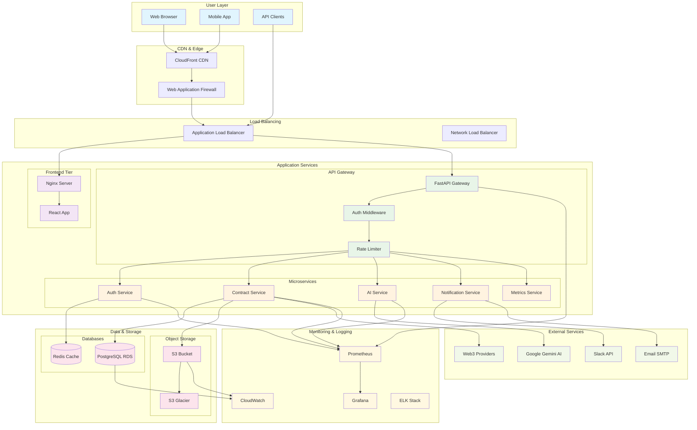

### **Service Layer Detail**

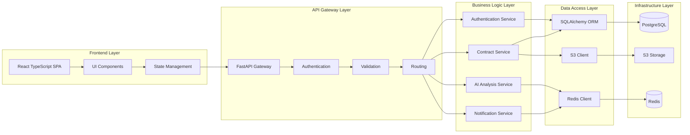

---

## 🌐 **Network Topology**

### **AWS VPC Architecture**

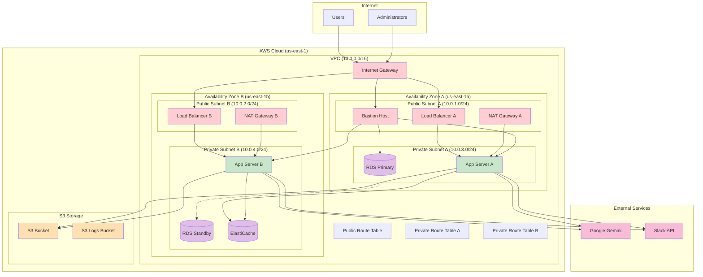

### **Security Groups & Network ACLs**

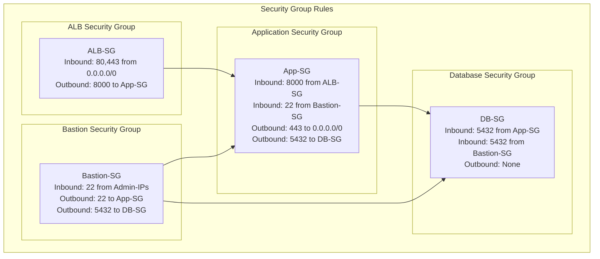

---

## 📊 **Data Flow Diagrams**

### **Contract Analysis Workflow**

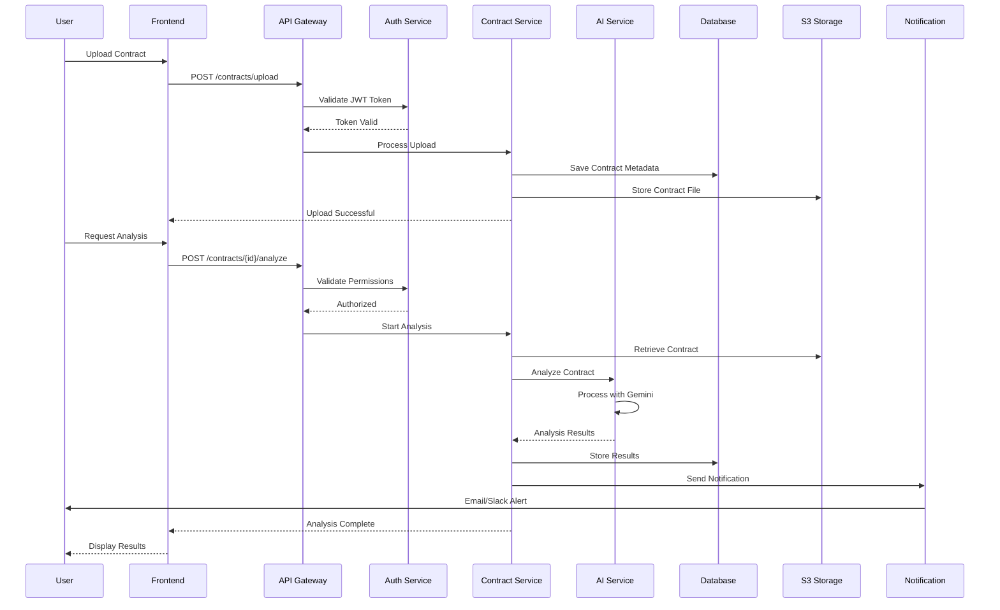

### **User Authentication Flow**

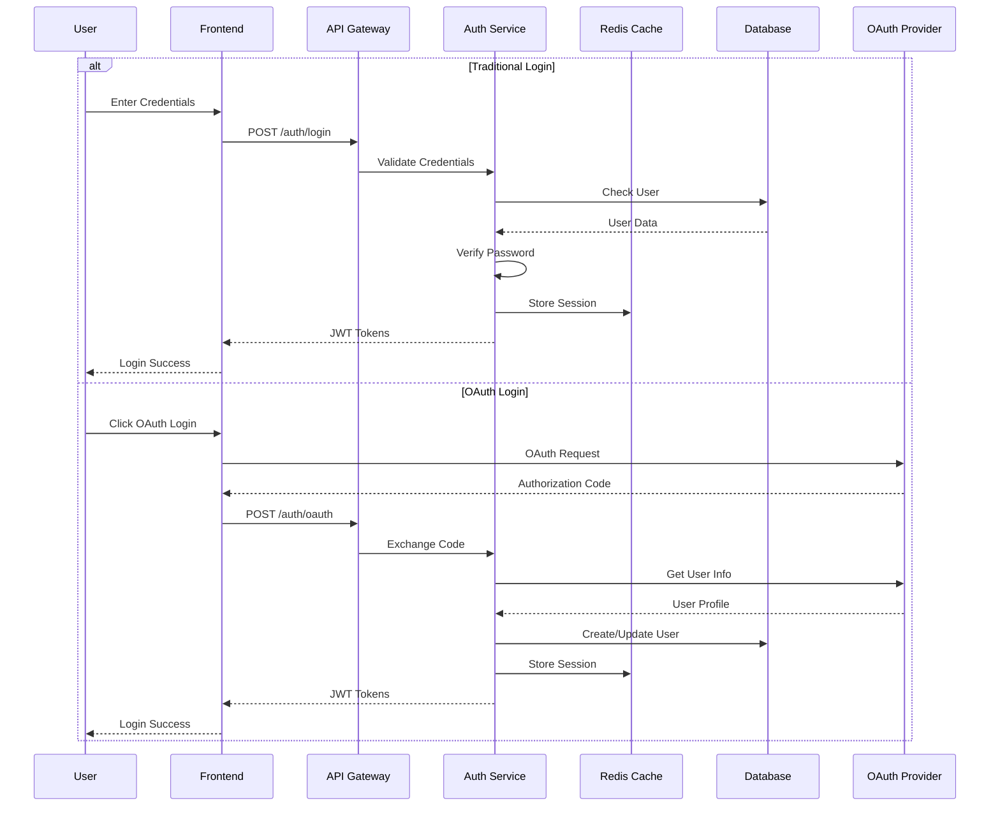

### **Data Processing Pipeline**

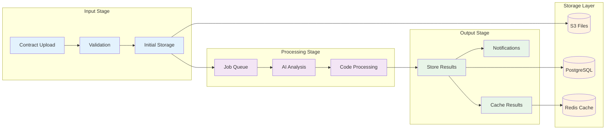

---

## 🚀 **Deployment Pipeline**

### **CI/CD Workflow**

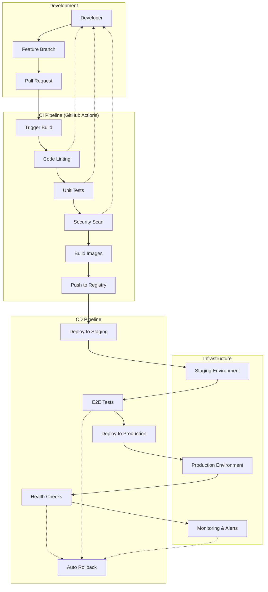

### **Container Deployment Strategy**

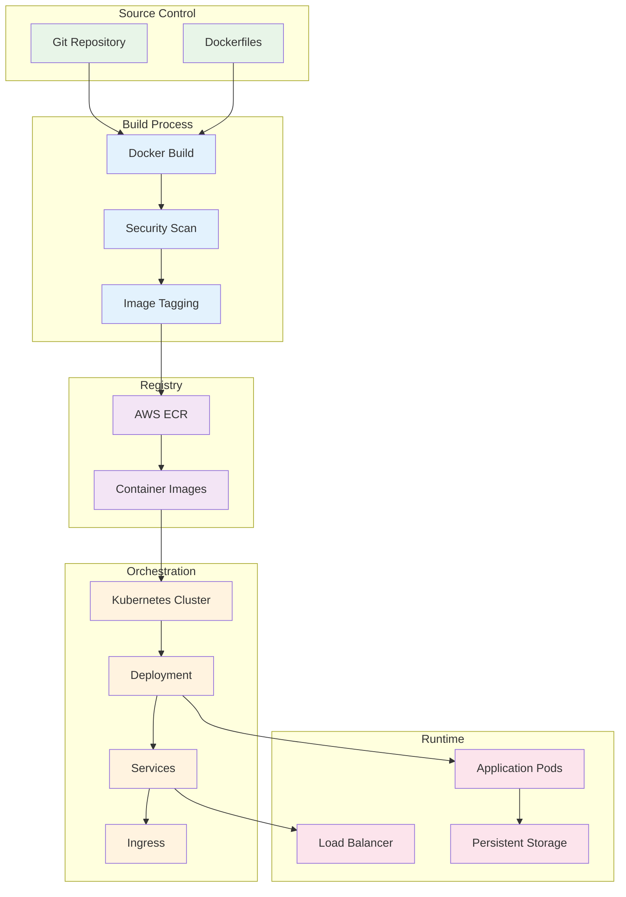

---

## 🔐 **Security Architecture**

### **Zero Trust Security Model**

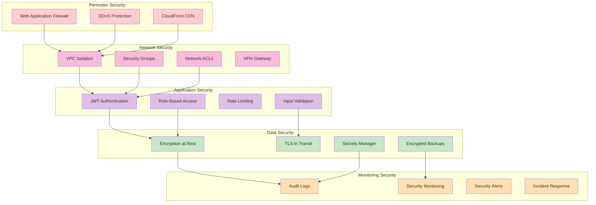

---

## 📈 **Monitoring Architecture**

### **Observability Stack**

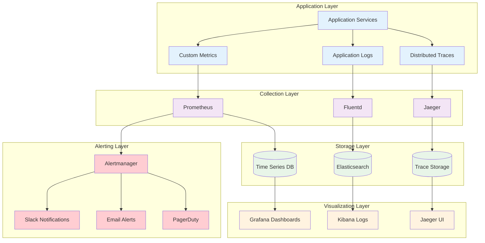

---

## 📱 **Mobile-First Responsive Design**

All diagrams are optimized for viewing on:
- 🖥️ **Desktop** - Full detail and interactivity
- 📱 **Mobile** - Simplified layouts with touch-friendly navigation
- 📊 **Print** - High-contrast, black & white compatible

---

**🎨 Visual Architecture Gallery Complete**

*These diagrams demonstrate enterprise-level system design thinking and architectural expertise*

[🔝 Back to Top](#-visual-architecture-gallery) • [📖 Main Documentation](../README.md) • [🏗️ Architecture Guide](architecture.md)

